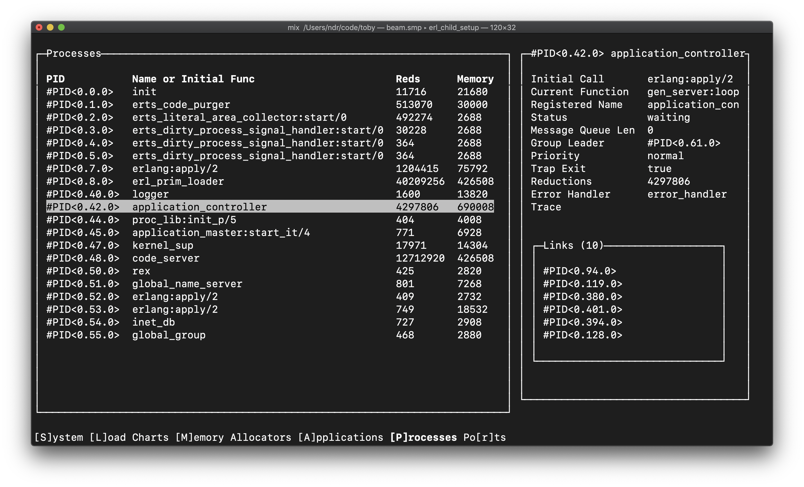

# Ratatouille

[](https://hex.pm/packages/ratatouille)
[](https://hexdocs.pm/ratatouille)

Ratatouille is a declarative terminal UI kit for Elixir for building rich
text-based terminal applications similar to how you write HTML.

It builds on top of the [termbox](https://github.com/nsf/termbox) API (using the
Elixir bindings from [ex_termbox](https://github.com/ndreynolds/ex_termbox)].

For the API Reference, see: [https://hexdocs.pm/ratatouille](https://hexdocs.pm/ratatouille).


*[Toby](https://github.com/ndreynolds/toby), a terminal-based Erlang observer built with Ratatouille*

## Getting Started

## First Steps

Let's go through the bundled [hello world example](./examples/hello_world.exs).
To follow along, clone this repo and edit the file, or create a Mix project with
`ratatouille` added to the deps and add code to a `.exs` file. Then you can run
it later with `mix run <file>`.

In a real project, you'll probably want to use an OTP application with a proper
supervision tree, but here we'll keep it as simple as possible.

First, some aliases for the modules we'll use:

```elixir
alias Ratatouille.{EventManager, Window}
```

Next, we import the view DSL from
[`Ratatouille.Renderer.View`](https://hexdocs.pm/ratatouille/Ratatouille.Renderer.View):

```elixir
import Ratatouille.Renderer.View
```

Now we'll initialize the application using `Ratatouille.Window`. This is a
gen_server that manages our terminal window and exposes a basic API for
accessing information about or updating the terminal window. On load, it draws a
blank canvas over the terminal:

```elixir
{:ok, _pid} = Window.start_link()
```

In order to react to keyboard, click or resize events, we'll use
`Ratatouille.EventManager`. The event manager allows processes to subscribe to
events and then send its subscribers a message whenever an event is triggered.
We need to start the event manager and subscribe the current process to any
events:

```elixir
{:ok, _pid} = EventManager.start_link()
:ok = EventManager.subscribe(self())
```

Next, we define a view. Similar to HTML, views are defined as a tree of nodes.
Nodes have attributes (e.g., text: bold) and children (nested content). Every
view must start with a root `view` element---it's sort of like the `<body>` tag
in HTML.

```elixir
hello_world_view =
  view do
    panel title: "Hello, World!", height: :fill do
      label(content: "Press 'q' to quit.")
    end
  end
```

Defining a view only does just that. To render it to the screen, we need to call
the `Window.update/1` function, passing our view as the argument.

```elixir
:ok = Window.update(hello_world_view)
```

When a key is pressed, it'll be sent to us by the event manager. Once we receive
a 'q' key press, we'll close the application. Here, we use the built-in
`receive` function with pattern-matching in order to match only the 'q' key
press event:

```elixir
receive do
  {:event, %{ch: ?q}} ->
    :ok = Window.close()
end
```

That's it---now you can run the program with `mix run <file>`. To run the
bundled example:

```bash
$ mix run examples/hello_world.exs
```

You should see the content we created and be able to quit using 'q'.

## Application Loops

TODO

## Writing Components

TODO

## Installation

### From Hex

Add Ratatouille as a dependency in your project's `mix.exs`:

```elixir
def deps do
  [
    {:ratatouille, "~> 0.1.0"}
  ]
end
```

### From Source

To try out the master branch, first clone the repo:

```bash
git clone https://github.com/ndreynolds/ratatouille.git
cd ratatouille
```

Next, fetch the deps:

```
mix deps.get
```

Finally, try out one of the included [`examples/`](examples):

```
mix run examples/rendering.exs > debug.log
```

If you see lots of things drawn on your terminal screen, you're good to go. Use
"q" to quit in the examples.
